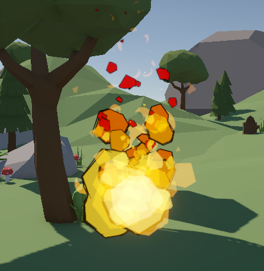
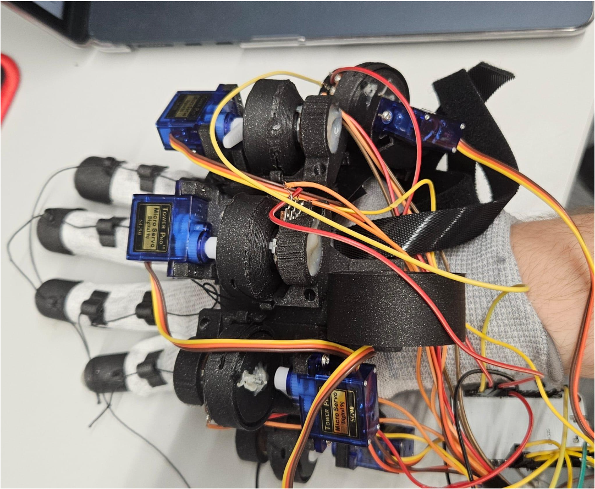
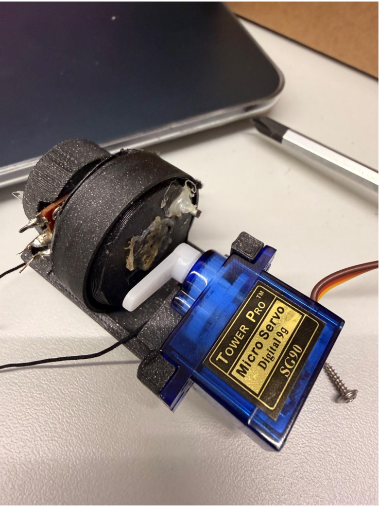
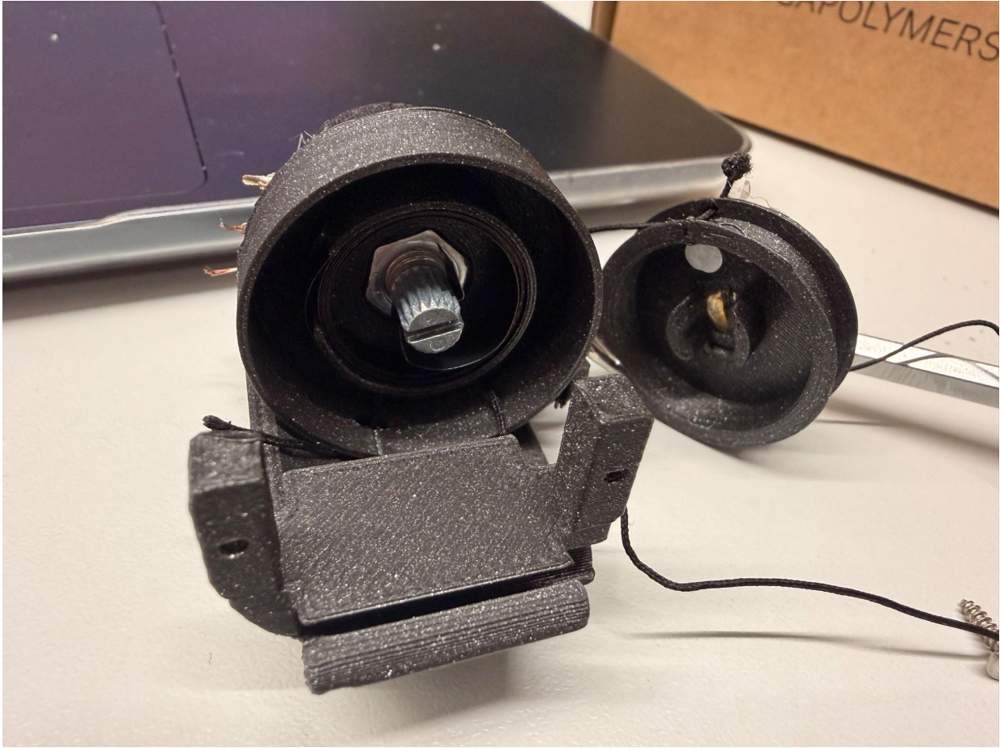

# Feeling the Spell: Enhancing Embodiment in VR via Haptic Gloves

An interactive, fantasy-themed Virtual Reality demonstration developed in **Unity** to evaluate the impact of cost-effective haptic VR gloves on user embodiment and immersion. To further test the multimodal aspect of immersion, the system integrates a custom speech recognition system that reacts to the user's spoken commands.

This repository serves as a portfolio showcase for our university **Fachprojekt** at **Technische Universität Dortmund**.

---

## 📄 Project Resources

* 📄 **[Read the Full Project Report (PDF)](Feeling_the_Spell.pdf)**

---

## 🚀 Key Features

* **Custom Haptic VR Gloves:** Built using cost-effective materials based on the open-source [LucidGloves by LucidVR](https://github.com/LucidVR/lucidgloves) design, enabling finger tracking and physical force feedback.
* **Speech-to-Text Pipeline:** A lightweight Python background service using the Vosk model, configured with `PartialResult` buffering to process spoken spell commands with minimal latency.
* **Advanced Gesture Engine:** Upgraded Unity XR interaction setups supporting sequential gesture combos, directional hand swipes, and complex 3D movement drawn in mid-air.
* **Dynamic Alchemy Circle:** An immersive alchemy circle where spell components (Coal, Feather, Battery, Flower) dynamically self-rearrange symmetrically before combining into active spells.
* **Heuristic Grasping System:** A custom algorithm built on top of the XR Direct Interactor that evaluates real-time finger curl values and palm thresholds to support natural pinch and power grabbing.

---

## 🛠️ Tech Stack

* **Game Engine & VR Framework:** Unity, XR Interaction Toolkit, XR Hands API, OpenXR
* **Version Control:** Plastic SCM
* **Audio & Speech Recognition:** Python, Vosk API, Sounddevice library, PyInstaller
* **Networking:** Local TCP Server/Client architecture
* **Hardware Components:** Microcontroller, Spring-loaded Potentiometers, Servo Motors, 3D-Printed Parts
* **Driver Interfacing:** Microcontroller Firmware (C++), [OpenGloves Driver by LucidVR](https://github.com/LucidVR/opengloves-driver)

---

## 🔮 Implemented Spells

1. **Fireball:** Thrown projectile that deals 20 baseline damage and spawns a burning fire zone on the ground dealing 10 damage/second.

  

2. **Green Fireball:** High-damage spell variant created with unique components to benchmark system scaling.

  

3. **Fire Arrow:** A complex spell behaving like a physical bow; the fire mass scales up visually as the player draws back and disappears if released prematurely.

  
  

4. **Lightning Spear:** High-velocity thrown projectile dealing 20 direct damage upon impact.

  

---

## 📸 Project Showcase

*Dynamic Alchemy Circle implemented in Unity.*

  
  
  

---

*Inventory implemented in Unity.*

  
  
  
  

---

*Glove Hardware & Tracker Assembly.*

  
  
  

---

## 👥 The Team & Contributions

This project was built as an academic **Fachprojekt** at **Technische Universität Dortmund** by a team of four:

* **[@MaxAd1234](https://github.com/MaxAd1234)**
  * Sourced and ordered all necessary components for the haptic glove.
  * 3D-printed, soldered, and assembled the hardware chassis.
  * Troubleshed and modified the microcontroller firmware wiring and voltage tracking.
  * Assisted with connecting the physical glove to Unity and performed ongoing hardware repairs.

* **[@cegredev](https://github.com/cegredev)**
  * Researched speech recognition technologies and created the core speech recognition system.
  * Wrote the backend server and client components in Python.
  * Packaged the server-side script into an executable using PyInstaller for Unity inclusion.
  * Implemented the Unity-side GUI for microphone selection via hotkey and resolved data transfer bugs.

* **[@AsasinsRus](https://github.com/AsasinsRus)**
  * Set up the base development environment and configured the Plastic SCM version control system.
  * Designed and implemented the structural systems in Unity.
  * Programmed the operational demo mechanics: inventory, spell creation, spell casting, and natural grasping heuristics.
  * Implemented input recognition handlers: directional movement, complex movement, and the improved gesture combo system.
  * Programmed the training dummy behavior and its responsive health bar.
  * Handled force feedback integration for the XR Interaction Toolkit and assisted with the speech-to-Unity connection.
  * Co-designed project spells and contributed to physical hardware testing and debugging.

* **[@dushan-developer](https://github.com/dushan-developer)**
  * Researched hand gesture recognition frameworks inside Unity.
  * Evaluated, imported, and updated deprecated Unity Asset Store packages for scene landscapes and spell components.
  * Co-designed and implemented specific spell layouts, visual behaviors, and animations.
  * Documented the codebase architecture for the demonstration scene.
  * Assisted with physical hardware construction and managed literature research for the written report.
